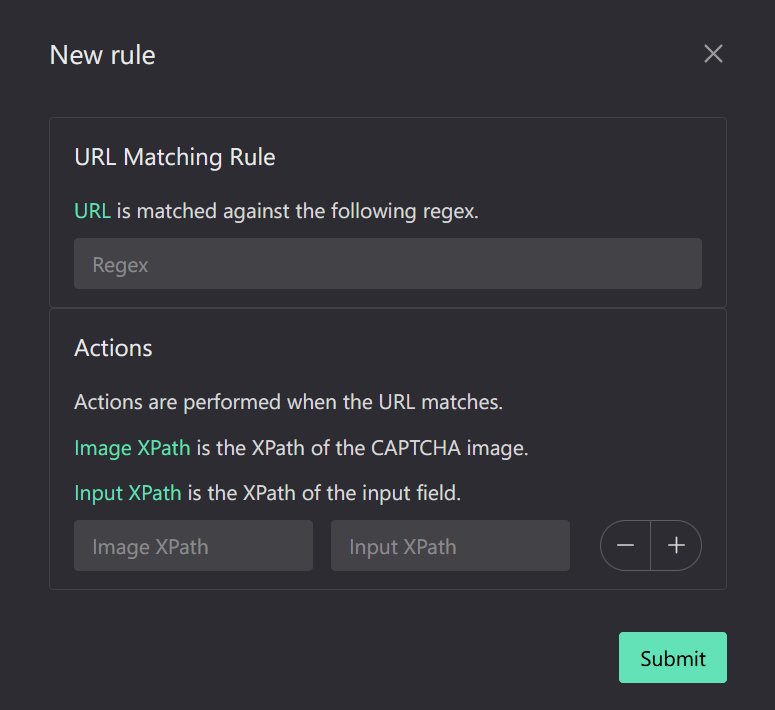
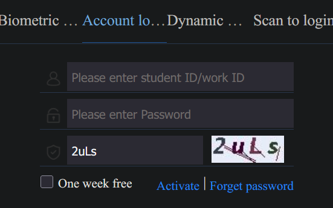

# Humanify

A browser extension to help you fill in image captchas.

## How to use

Open extension options page, create a new rule.



Write a `regex expression` to match the target URL you want to apply the rule to.

Open `Devtool`, crank up `element picker`, select the captcha image and copy `XPath`.

Same for the input field.

When everything is ready, save the rule. Then just reload the target page, the extension will automatically fill in the captcha for you, just like this:



## How to build

Clone the repo, run `pnpm i` to install dependencies.

Build with:

```bash
TARGET=firefox pnpm build
```

If you want to build for Chrome, just modify environment variable `TARGET` to `chrome`.

Then just load the extension in your browser.

## Credits

[ddddocr](https://github.com/sml2h3/ddddocr) for captcha image recognition.
